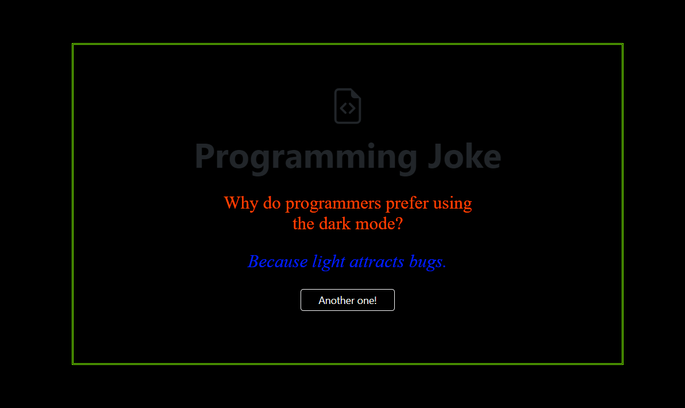

# Programming Jokes :)

This simple HTML webpage fetches and displays programming jokes from the JokeAPI. Each time you click the "Another one!" button, a new joke will appear on the page.

## Snap 🖼️

## Demo 💻
[Ctrl+Alt+Delight😜](https://alokverma18.github.io/Programming-Jokes/)

Enjoy a good laugh with your fellow programmers!

## Credits

- Jokes provided by [JokeAPI](https://v2.jokeapi.dev/)

## 
### Feel free to Contribute, Share, and have fun with Programming Jokes!
##

## Connect 👋

## 
### Leave a 🌟 if it was Helpful!!
### Thanks!

